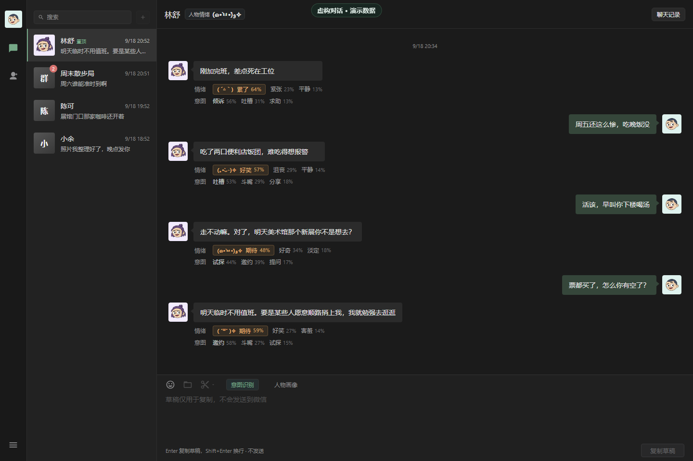
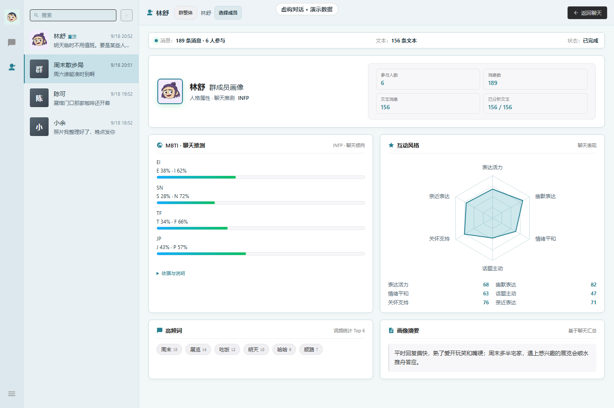
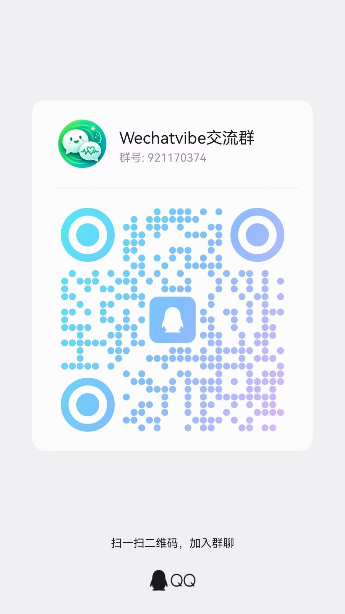

# WechatVibe

微信聊天情感分析客户端，支持意图识别、情绪感知、人物画像、群聊画像、好感度分析和 MBTI 聊天推测。

- **分析模型**：默认使用本地 [Laya](https://github.com/NandhaKishorM/laya) [多语言 ONNX 模型](https://huggingface.co/mizchi/laya-multilingual-onnx)；也可接入兼容 API 分析消息和生成画像摘要。
- **微信数据读取**：基于 [wechatauto-replica](https://github.com/fanyuantaier/wechatauto-replica) 的本地数据库接口，只读获取当前登录微信账号的会话和消息。

项目适合想回看聊天中的情绪变化、了解日常交流方式的用户。单聊中可查看对方消息的情绪、意图和人物画像；群聊中可查看整体氛围、互动特点及成员画像。

[](LICENSE)

[功能介绍](#功能介绍) · [下载安装](#下载安装) · [软件更新](#软件更新) · [首次使用](#首次使用) · [更多截图](#更多截图) · [源码运行](#源码运行) · [数据与隐私](#数据与隐私) · [交流与建议](#交流与建议)



## 功能介绍

### 意图识别

在聊天界面打开「意图识别」，对方消息下方会显示可能的交流意图，例如分享、邀约、试探、求安慰、敷衍或婉拒。

- **本地模式**：每条已分析的消息最多显示三个意图候选及其概率。
- **API 模式**：由所选模型给出简短的情绪和意图标签。
- **结合上下文**：结合近期聊天和已保存的人物画像，识别当前消息的交流意图。
- **简短标签**：相近细项统一显示为分享、承诺、协商等常用词。
- **随时开关**：关闭或显示消息标签，重新打开时恢复已有结果。

翻看历史记录时，API 模式按当前可见消息逐批识别；已完成的结果按账号、会话和模型来源保存。

### 情绪感知

开启「意图识别」后，消息下方同时显示情绪。API 模式只显示情绪与意图两个短标签。

- **消息情绪**：显示开心、期待、委屈、生气、累了等情绪候选，每行最多三个，并保留各自的概率。
- **颜文字**：为主要情绪配上颜文字，直接放在消息分析行中。
- **人物情绪**：单聊顶部展示当前聊天对象的情绪状态。
- **群聊氛围**：群聊顶部展示整体氛围，和具体成员的消息情绪分开查看。

### 人物画像

从聊天工具栏或左侧导航进入「人物画像」，查看当前聊天对象的分析结果。

- **互动风格**：六维雷达展示表达活力、幽默表达、情绪平和、话题主动、关怀支持和亲近表达，图表各顶点有对应名称。
- **画像摘要**：与雷达图、高频词放在同一页面。API 模式可用所选模型更新摘要，原有好感度、MBTI 和互动雷达仍由本地 Laya 计算。
- **高频词**：保留六个常见词，方便回看对方常聊什么。
- **分析进度**：显示已分析文本数和当前状态，处理中可查看速率。
- **保存与续算**：再次进入时先显示上次保存的画像，新消息在原有结果上继续更新。

### MBTI 聊天推测

人物画像中的 MBTI 按 E/I、S/N、T/F、J/P 四个维度展示倾向。该人物积累到 100 条有效文本后，可点击「解锁人格」查看；证据不足的维度保留未确定状态。

### 好感度分析

单聊人物画像中显示好感度数值和等级，和互动风格、画像摘要一起查看。已有结果会保留，后续随新消息分析更新。

### 群聊画像

打开群聊后进入画像页面，可以在「群整体」和具体成员之间切换。

- **群整体**：查看参与人数、消息与文本数量、分析进度、六维互动风格、常见词和群聊摘要。
- **成员画像**：从「选择成员」中搜索或翻页选择对象，每页六人，查看该成员的互动风格、摘要和 MBTI 聊天推测。
- **分别保存**：群整体与每个成员分别积累结果，切换时显示对应对象的画像。
- **群聊氛围**：在聊天页查看整体情绪，在消息下方查看各个发言者的情绪与意图。

### 聊天记录与账号管理

软件从本机已登录微信读取会话，支持单聊、群聊、联系人和群头像。聊天中的图片消息显示为 `[图片]`。

- **历史记录**：分页查看更早的消息，按关键词或日期查找，并定位到对应上下文。
- **信息列表**：首次进入只读取会话目录，不加载全部聊天。在设置中添加要查看的会话；从列表移除不会删除聊天缓存或画像。
- **账号数据库**：按真实微信账号分别保存数据；新账号创建独立数据库，已有账号复用原来的记录。
- **账号清除**：在账号管理中选择要清除的账号，删除它在 WechatVibe 内的聊天副本、分析、画像和相关缓存。
- **退出规则**：清除当前账号成功后退出软件；清除其他账号保持当前软件运行。

### 增量分析与运行设置

画像分析会逐步处理本地可用的历史消息，保存结果和进度。之后把新增消息收成一批，处理后与已有画像合并，不因切换聊天或重启软件重新分析全部历史。

通用设置提供浅色/深色主题、界面缩放和 CPU/GPU 运行选项；GPU 不可用时支持回退到 CPU。

「模型来源」默认使用本地 Laya，也可接入 Anthropic、Responses、Chat Completions、Gemini 或 Ollama 兼容接口。填写 Base URL、API Key 和模型上下文大小后，可获取模型列表、测试连接并启用。接口提供上下文大小时会自动填入；未提供时由用户填写。API 画像按上下文容量自动分批，装得下就一次处理，超出后续批次继承已保存摘要。

## 更多截图

### 群成员画像



## 下载安装

从 [Releases](https://github.com/tswawa/WechatVibe/releases) 下载 `WechatVibe-1.0.5-windows-x64.zip`。这是默认运行包，不内置 Laya 模型。解压后保留整个 `win-unpacked` 目录，双击其中的 `WechatVibe.exe`。需要本地分析时，在「设置 → 本地部署」点击下载模型，或选择已有的模型目录。`-full.zip` 是可选的完整包，已内置模型。

### 运行要求

| 项目 | 要求 |
| --- | --- |
| 系统 | Windows 10/11 x64 |
| 微信 | Windows 微信 **4.x**；当前已实测 **4.1.15.13** |

**不支持微信 3.x。** 使用旧版微信时，请先更新微信并重新登录，再启动 WechatVibe。若停在「当前微信账号未就绪」，请先检查微信版本。

运行时请保留整个解压目录。

## 软件更新

打开「设置 → 关于 → 当前版本」，即可检查更新。发现新版本后，点击「下载并安装」；软件会显示进度，校验下载文件，安装完成后自动重启。Windows 使用系统 HTTP 代理时，更新器会沿用该代理连接 GitHub。

更新会保留本地账号数据库、分析结果、画像和已下载的模型。从旧版升级到默认运行包时，原来内置的 Laya 模型也会保留，设置中显示为已就绪。安装失败时会恢复旧版；更新成功后，可以在同一窗口回退到上一版。回退使用本地备份，只保留最近一次可回退版本。

## 首次使用

1. **检查微信并登录**：确认使用 Windows 微信 4.x（已实测 4.1.15.13），登录要分析的账号。
2. **启动软件**：解压运行包，双击 `WechatVibe.exe`。账号与聊天校验状态可在「设置 → 管理账号」查看；软件界面和更新入口无需等待聊天预加载完成。
3. **选择模型**：轻量版可在「设置 → 本地部署」下载 Laya，或选择已有的 Laya 模型目录；使用完整包时会自动识别内置模型。
4. **添加会话**：在「设置 → 信息列表」选择联系人或群聊；左侧只显示已添加的会话，并按需读取其消息。
5. **查看分析**：打开已添加的聊天，点击「意图识别」查看消息标签。
6. **查看画像**：进入「人物画像」；群聊可继续选择具体成员。已经保存的结果会先显示，新消息继续更新。

## 源码运行

需要 Node.js **24.11.1**、Python **3.14** 和 npm。在 PowerShell 中执行：

```powershell
git clone https://github.com/tswawa/WechatVibe.git
cd WechatVibe
npm ci
py -3.14 -m venv .venv
.\.venv\Scripts\python.exe -m pip install --no-deps -r python-requirements.lock.txt
npm run setup:models
npm start
```

模型首次下载约 680 MB，下载后校验 SHA-256。Python 安装时请按锁文件安装并保留 `--no-deps`。

### 构建运行版

完成上述依赖和模型安装后，在同一个 PowerShell 窗口运行：

```powershell
$env:PATH = "$PWD\.venv\Scripts;$env:PATH"
npm run build:portable
```

构建命令会打印本次独立的产物目录：`.local/portable-builds/build-*/release/win-unpacked/WechatVibe.exe`。整个 `win-unpacked` 目录构成运行版，包含模型和运行环境。

### 修改词库

当前词库包含 40 个情绪、547 个意图细项、98 个表达方式和 80 个人际需求。同义意图共用 215 个简短显示词，表达方式与人际需求两组词表生成 7,840 个组合。

源文件为 `scripts/analysis-catalog-source.json`、`scripts/intent-display-source.json` 和 `scripts/social-intent-source.json`。修改时保留既有 ID，然后执行：

```powershell
npm run catalog:generate
```

## 数据与隐私

默认 Laya 模式在本机推理，本地服务只监听回环地址。手动启用 API 模式后，情绪与意图分析会把所选消息及最多三条前文发送到配置的模型服务；API 画像会按所填上下文大小发送所选会话的本机可用历史文本，用于生成和更新摘要。本地好感度、MBTI 和互动雷达仍由 Laya 计算。聊天副本、分析结果和画像按账号保存。

- 只读取自己有权访问的账号和聊天，不用于获取他人的私人记录。
- 清除账号只删除 WechatVibe 保存的数据，不删除微信原始聊天。
- 软件只分析和展示，草稿仅供复制，不自动发送微信消息。
- 不要把聊天数据库、解密密钥、账号缓存或带私人内容的日志上传到仓库、Issue 或交流群。
- 反馈问题前先检查截图和日志，移除不想公开的姓名、账号和对话。

## 免责声明

意图、情绪、好感度和 MBTI 都是模型推测，可能判断错误，仅用于娱乐和个人复盘，不等于对方真实想法、心理诊断或官方测评结果。

微信版本更新可能影响读取兼容性，项目不承诺“零风险”或“不会封号”。WechatVibe 为独立项目，与腾讯、微信没有官方隶属或背书关系。

## 交流与建议

QQ 交流群：**921170374** 对项目有改进建议，或者想交流使用经验欢迎加入本群



作者：[tswawa](https://github.com/tswawa) · 问题反馈：[GitHub Issues](https://github.com/tswawa/WechatVibe/issues)

## 许可与致谢

项目采用 [Apache-2.0](LICENSE)。Laya、模型与第三方依赖的来源及许可见 [THIRD_PARTY_NOTICES.md](THIRD_PARTY_NOTICES.md)。

演示头像使用 Lisa Wischofsky 的 [Adventurer](https://www.dicebear.com/styles/adventurer/) 插画，经 DiceBear 组合并调整配色，采用 [CC BY 4.0](https://creativecommons.org/licenses/by/4.0/)；该素材许可独立于项目代码许可。
